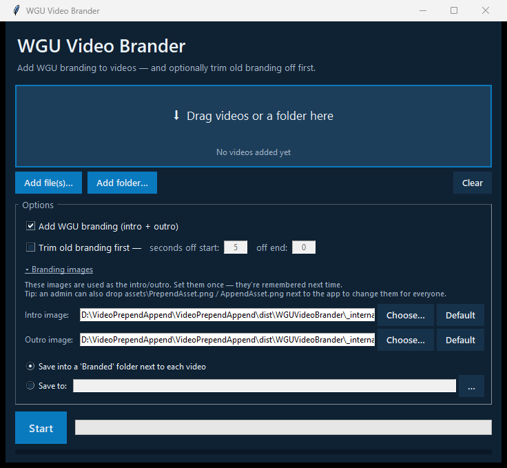

# WGU Video Brander

Add WGU branding to videos: a title-slide **intro** with each video's **Video
Title** and **Course Title** drawn onto the official WGU slide, plus the WGU
**outro** — and, when needed, trim old branding off the start or end first.

There are two ways to use it:

- **The app (`WGUVideoBrander.exe`)** — a simple click-and-run window for
  everyone. **No Python, no command line, no ffmpeg install.** Just download,
  double-click, drag in your videos, and press **Start**.
- **The command-line tool (`process_videos.py`)** — for power users who want to
  batch-process folders or script the process.

Both share the same video engine (`core.py`), so the results are identical.



---

## Download

Grab the latest **`WGUVideoBrander.zip`** from the
[**Releases**](../../releases) page, unzip it anywhere, and run
`WGUVideoBrander.exe`. Nothing else to install.

---

## For most people: using the app

1. Get the **`WGUVideoBrander`** folder (from your IT/admin, or build it —
   see below). Keep the folder together.
2. Double-click **`WGUVideoBrander.exe`**.
   - First launch may be a little slow, and Windows SmartScreen/antivirus may
     ask you to confirm an unrecognized app — click **More info → Run anyway**.
3. **Add your videos** one of two ways:
   - **Drag and drop** video files (or a whole folder) onto the drop area, or
   - Click **Add file(s)…** / **Add folder…**.
4. **Set each video's titles** (both optional) in the **Video titles** list:
   - **Course title (all videos)** — type it once at the top and it fills in
     for every video. Edit any row's **Course title** to override just that one.
   - **Video title** — set per row. This is the big title on the intro slide.
   - Leave a title blank to omit it; an empty intro slide is fine.
5. Choose what to do:
   - ☑ **Add WGU branding** — puts the WGU title-slide intro before and the WGU
     outro after each video (on by default).
   - ☐ **Trim old branding first** — turn this on only if the video already has
     old branding to remove. Enter how many **seconds to cut off the start**
     and/or **off the end**.
6. Press **Start**. Progress shows in the log at the bottom.
7. By default, finished videos are saved into a **`Branded`** folder next to
   each source video. (You can pick a different output folder in **Options**.)

### The intro template and outro image

The **intro** is the WGU title slide with its title boxes left empty; the app
draws each video's Video Title / Course Title onto it at run time. The **outro**
is the WGU end slide, shown as-is. Both are held full-screen for 5 seconds.

You normally never touch these. To use a different template or outro, expand
**Advanced: intro template & outro image** in Options and click **Choose…**
(PNG/JPG). Your choices are **remembered** next time; click **Default** to go
back to the built-in image.

**Admin tip — set the artwork for everyone without rebuilding:** create an
`assets` folder next to `WGUVideoBrander.exe` containing `intro_template.png`
(the empty title slide) and/or `AppendAsset.png` (the outro). Those override the
built-in copies for every user of that copy.

**Where the official images live:** the current WGU intro template / outro
always live in this repo's [`assets/`](assets) folder, generated from the WGU
PowerPoint in [`template/`](template) via `render_template.py`. Branding rarely
changes, but if it ever does, download the latest PNGs from there and either
drop them next to the app (admin tip above) or pick them via **Choose…** — no
full re-download needed. The bundled release is simply a snapshot of those same
repo images.

### Supported video formats

`.mp4`, `.avi`, `.mov`, `.mkv`, `.wmv`, `.flv`, `.m4v`

---

## For power users: the command line

Requires **Python 3.6+**. ffmpeg is used from the bundled `ffmpeg/` folder if
present, otherwise from your system `PATH`.

```powershell
# Brand every video in SourceVids -> ModifiedVids (bundled WGU assets)
python process_videos.py

# Custom in/out folders
python process_videos.py "C:\clips" "C:\clips\out"

# Set the titles drawn on the intro slide (same for every video in the batch)
python process_videos.py "C:\clips" "C:\out" --video-title "Overview" --course-title "C949 - Data Structures"

# Brand AND trim 5s off the start, 3s off the end
python process_videos.py "C:\clips" "C:\out" --trim-start 5 --trim-end 3

# Trim only, no branding
python process_videos.py "C:\clips" "C:\out" --no-branding --trim-start 5

# Use a custom intro template / outro image
python process_videos.py --intro-template slide.png --append outro.png
```

In batch mode the same titles are applied to every video; use the app for
**per-video** titles. Run `python process_videos.py --help` for all options.

---

## Building the app (`.exe`) yourself

You only need to do this to (re)create the distributable app — for example
after dropping in the **real WGU branding images**.

### One-time setup

```powershell
# 1. Install build dependencies
python -m pip install -r requirements.txt

# 2. Download the ffmpeg binaries that get bundled (~100 MB each).
#    These are NOT stored in git.
python get_ffmpeg.py
```

### Update the branding images from the WGU template

The intro template and outro are **committed to the repo** and bundled into the
`.exe`, so the app builds and runs out of the box:

```
assets\intro_template.png  <- WGU title slide, empty boxes; titles drawn on it
assets\AppendAsset.png     <- WGU end slide, shown at the END of every video
```

When the WGU PowerPoint template changes, regenerate both PNGs from it with
PowerPoint installed (uses COM automation via pywin32):

```powershell
python render_template.py
# or point it at a specific file:
python render_template.py "path\to\WGU Video Template - Instructor Resources.pptx"
```

This exports slide 2 (title slide, boxes left empty) to `intro_template.png` and
slide 4 (end slide) to `AppendAsset.png` at 1920×1080. If the title/subtitle
position, font, or size changed in the template, update the `INTRO_*` constants
in `core.py` to match. `render_template.py` is a **build-time** tool — end users
never run it; the app ships the already-rendered PNGs.

> Because these files are **committed** (they are *not* in `.gitignore`), the
> real art travels with the project. After regenerating them, commit the
> change and **rebuild/publish a new release** — see
> ["Do updated images reach existing users?"](#do-updated-images-reach-existing-users)
> for how the update actually reaches people.

### Build

```powershell
# Easiest: run everything at once
build.bat

# ...or manually:
python -m PyInstaller WGUVideoBrander.spec --noconfirm
```

The finished app appears in **`dist\WGUVideoBrander\`**. Zip that folder (or
share it as-is) and hand it to users — everything they need, including ffmpeg,
is inside.

---

## Do updated images reach existing users?

**Short answer: not automatically.** The branding images are baked into the
`.exe` when it is built. If the maintainer updates the images in the repo, that
only changes **future builds** — copies people already downloaded keep their
old branding. To roll out new branding, use one of these:

| Method | Who does it | Reaches whom |
|---|---|---|
| **Rebuild + publish a new release**, users re-download | maintainer | everyone who updates |
| **Drop `assets\intro_template.png` / `AppendAsset.png` next to the `.exe`** | local admin | that one copy/machine |
| **In-app "Advanced: intro template & outro image → Choose…"** (remembered between sessions) | each user | that user |

If you want branding to **auto-update from the repo** — the maintainer updates
the images once and every user's app pulls them on next launch — that needs an
extra feature (the app downloading the images from the repo's raw URL at
startup). It isn't built yet; it's a straightforward addition if desired.

---

## Project structure

```
VideoPrependAppend/
├── gui.py                  ← the desktop app (window, drag & drop, titles)
├── core.py                 ← shared engine (title rendering + ffmpeg trim/brand)
├── process_videos.py       ← command-line batch tool
├── render_template.py      ← build-time: regenerate the PNGs from the .pptx
├── get_ffmpeg.py           ← downloads ffmpeg for bundling
├── build.bat               ← one-click build script
├── WGUVideoBrander.spec    ← PyInstaller build recipe
├── requirements.txt
├── assets/                 ← branding images (bundled into the app)
│   ├── intro_template.png  ← WGU title slide (titles drawn on at run time)
│   └── AppendAsset.png     ← WGU outro
├── template/               ← source WGU PowerPoint for render_template.py
├── ffmpeg/                 ← ffmpeg.exe / ffprobe.exe (fetched, not in git)
├── SourceVids/             ← optional: source videos for the CLI
└── ModifiedVids/           ← optional: CLI output
```

---

## How it works

- The intro is built by drawing the **Video Title** (Arial, bottom-anchored
  above the green line, shrinking to fit long titles) and **Course Title**
  (below the line) onto the WGU title-slide template — reproducing the
  PowerPoint layout without needing PowerPoint at run time.
- Each video is (optionally) **trimmed** and then gets that **5-second intro**
  prepended and a **5-second outro** appended, in a **single re-encode pass**
  (so trimming adds no extra quality loss).
- Everything is re-encoded to **H.264 / AAC** in an MP4 container. Source files
  are **never modified**.
- Branding images are scaled to each video's resolution with
  letterboxing/pillarboxing so nothing is distorted.
- If a source video has no audio, the intro/outro are silent to match, so the
  join stays clean.

---

## Troubleshooting

| Symptom | Fix |
|---|---|
| Windows warns about an unrecognized app | Click **More info → Run anyway** (the app is unsigned). |
| App says ffmpeg was not found (from source) | Run `python get_ffmpeg.py`, or put `ffmpeg.exe`/`ffprobe.exe` in the `ffmpeg` folder. |
| "Trim amount is longer than the video" | Reduce the seconds you're trimming off the start/end. |
| Intro template / outro image not found | Expand **Advanced: intro template & outro image** and pick valid image files, or rebuild after placing them in `assets/`. |
| Output looks wrong / no branding | Make sure at least one of **Add WGU branding** or **Trim** is turned on. |
